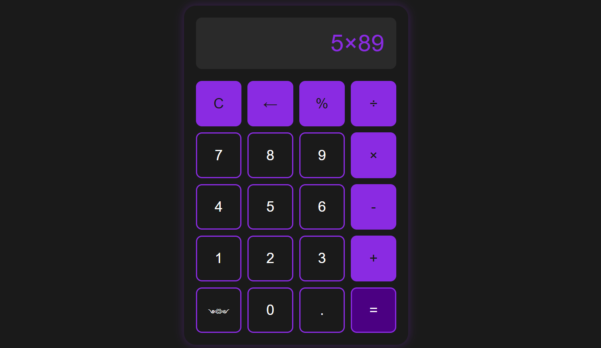

# Purple Calculator

A sleek, modern calculator web application with a beautiful purple theme. This calculator provides standard arithmetic operations with a user-friendly interface.

## Features

- Basic arithmetic operations (addition, subtraction, multiplication, division)
- Percentage calculations
- Backspace functionality

- Clear function
- Responsive design that works on both desktop and mobile devices
- Proper mathematical symbols (× for multiplication, ÷ for division)
- Dynamic font sizing for large numbers
- Beautiful purple-themed UI with hover effects

## Technical Details

Built using:
- HTML5
- CSS3
- Vanilla JavaScript (ES6+)

The calculator implements:
- Real-time display updates
- Operator chaining
- Error handling for division by zero
- Decimal point validation
- Responsive layout using CSS Grid
- Touch-friendly interface

## Usage

The calculator supports:
- Numbers (0-9)
- Decimal points
- Basic operators (+, -, ×, ÷)
- Percentage calculations
- Clear button (C)
- Backspace button (←)
- Equals button (=)

## Design

- Dark mode interface with purple accents
- Soft glow effects
- Responsive buttons with satisfying hover and click animations
- Clear, easy-to-read display
- Adaptive layout for different screen sizes

## Installation

1. Clone the repository
2. Open `index.html` in your web browser
3. Start calculating!

No additional dependencies or installation required.

## Browser Support

Works on all modern browsers including:
- Chrome
- Firefox
- Safari
- Edge

## License

MIT License

Copyright (c) 2024

Permission is hereby granted, free of charge, to any person obtaining a copy
of this software and associated documentation files (the "Software"), to deal
in the Software without restriction, including without limitation the rights
to use, copy, modify, merge, publish, distribute, sublicense, and/or sell
copies of the Software, and to permit persons to whom the Software is
furnished to do so, subject to the following conditions:

The above copyright notice and this permission notice shall be included in all
copies or substantial portions of the Software.

THE SOFTWARE IS PROVIDED "AS IS", WITHOUT WARRANTY OF ANY KIND, EXPRESS OR
IMPLIED, INCLUDING BUT NOT LIMITED TO THE WARRANTIES OF MERCHANTABILITY,
FITNESS FOR A PARTICULAR PURPOSE AND NONINFRINGEMENT. IN NO EVENT SHALL THE
AUTHORS OR COPYRIGHT HOLDERS BE LIABLE FOR ANY CLAIM, DAMAGES OR OTHER
LIABILITY, WHETHER IN AN ACTION OF CONTRACT, TORT OR OTHERWISE, ARISING FROM,
OUT OF OR IN CONNECTION WITH THE SOFTWARE OR THE USE OR OTHER DEALINGS IN THE
SOFTWARE. 